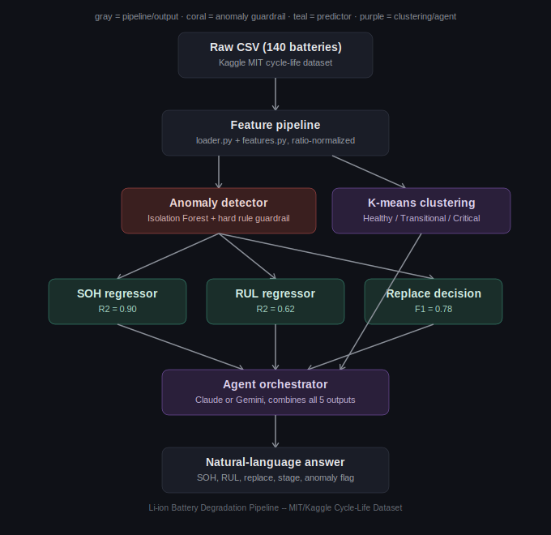
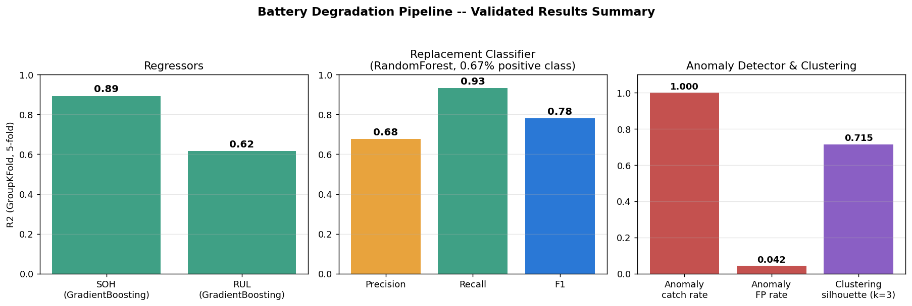

# Li-ion Battery Degradation Pipeline

## Table of Contents
- [Introduction](#introduction)
- [Architecture](#architecture)
- [Data](#data)
- [Models Used](#models-used)
- [Model Metrics](#model-metrics)
- [Project Structure](#project-structure)
- [How to Run](#how-to-run)
- [Sample Output](#sample-output)
- [Issues Faced](#issues-faced)
- [Conclusion](#conclusion)
- [Utilities](#utilities)
- [References](#references)

---

## Introduction

This project estimates a lithium-ion battery's **State of Health (SOH)**,
**Remaining Useful Life (RUL)**, and whether it **needs replacement**, using
only indirect behavioral signals from its charge/discharge cycling data and
never the raw capacity readings that would make the problem trivial and introduce the issue of data leakage. It also
includes an **anomaly detector** (flags corrupted or out-of-distribution
cycles) and **unsupervised clustering** (groups cycles into Healthy /
Transitional / Critical degradation stages), all wrapped in an **LLM agent**
that answers natural-language questions about a battery's condition.

The project went through two full iterations: an initial V1 data leakage affected version and
then rebuilt as V2 with all the issues fixed and using indirect signals to train the models.
Several real bugs such as data leakage, a flawed RUL formula, a clustering bug were
found and fixed along the way.

This project was made only following the motivation to learn more about ML. Even though this was the
reason for the project, it still functions quite well and infact matches better complex models in 
terms of performance. The most important lesson for me was using a data centric apporoach 
in the project over a model-centric one.

Something worth noting is that there was a V0 before all of this using NASA's data on kaggle instead. However the small size of the dataset especially with only 2000 rows was not enough to train the model to be accurate as this problem statement often has a lot of variation and noise which can only be fixed with more data or extremely complex algos which i had no knowledge of.

## Architecture



Raw cycle data flows through a feature pipeline into two guardrail/insight
components (anomaly detection, clustering) and three supervised predictors
(SOH, RUL, replacement), all of which feed into an LLM agent that combines
them into one natural-language answer.

## Data

**Source:** [Kaggle -- Lithium-Ion Battery Cycle Life Time Series Dataset](https://www.kaggle.com/datasets/solitaryseeker/lithium-ion-battery-cycle-life-time-series-dataset)
(originally from the MIT/Stanford/Toyota fast-charging battery aging study).

- **140 batteries**, 114,598 raw cycles total
- Multiple fast-charging protocols (single-step and two-step CC-CC-CV),
  producing genuinely different absolute charge-time/resistance scales per
  battery- a key reason features are ratio-normalized.
- Per-cycle fields: `IR` (internal resistance), `QC`/`QD` (charge/discharge
  capacity), `Tavg`/`Tmin`/`Tmax`, `chargetime`, plus per-battery protocol
  parameters `C1`/`Q1`/`C2` and the recorded `cycle_life`
- Cycle life ranges from 148 to 2,237 cycles across the fleet with large
  genuine heterogeneity and not noise.

## Models Used

| Component | Algorithms compared | Best |
|---|---|---|
| SOH regressor | Linear Regression, Random Forest, Gradient Boosting | Gradient Boosting |
| RUL regressor | Linear Regression, Random Forest, Gradient Boosting | Gradient Boosting |
| Replacement classifier | Logistic Regression, Random Forest, Gradient Boosting | Random Forest |
| Anomaly detector | Isolation Forest + hard ratio-threshold rule | -- |
| Clustering | K-means (k selected via elbow + silhouette) | k=3 |

SVM/SVR were deliberately excluded as they were too slow at this row count (114k+
rows x 5-fold GroupKFold) for the marginal benefit seen during my prior development with the mentioned V0
in introduction.

##Model Metrics



| Component | Metric | Result |
|---|---|---|
| SOH regressor | R2 (GroupKFold) | **0.893** |
| RUL regressor | R2 (GroupKFold) | **0.616** |
| Replacement classifier | F1 / Precision / Recall | **0.78 / 0.68 / 0.93** |
| Anomaly detector | Known-glitch catch rate / false-positive rate | **100% / 4.2%** |
| Clustering | Silhouette (k=3) | **0.72** |

All supervised results validated with **GroupKFold grouped by
`battery_id`** -- a battery's cycles never appear in both train and test,
which a random split would allow (cycle 500 and 501 of the same battery are
nearly identical -- that's leakage, not learning).

## Project Structure

```
V2/
  source/
    loader.py     -- raw CSV load + cleaning
    features.py   -- leak-free feature engineering + label computation
    models.py     -- trains/evaluates all 5 components, agent-facing predict functions
    pipeline.py   -- integration layer: battery baseline + run_battery_pipeline()
  models/          -- saved .pkl model bundles (scaler + model + feature list)
V1/               --Initial version that had data leakge. Included to show the issue
agent/
  agent.py         -- Gemini-backed natural-language agent
data/
  raw/             -- source CSV
  processed/       -- engineered feature table for V1 and V2
notebooks/         -- 01-06, EDA through full pipeline integration
outputs/            -- architecture diagram, results chart
```

## How to Run

```bash
pip install pandas numpy scikit-learn joblib
pip install google-genai    # for agent.py
```

```bash
# rebuild features from raw data
python3 V2/source/features.py data/raw/"Lithium-Ion Battery Cycle Life.csv"

# train all 5 models
python3 V2/source/models.py

# query a battery through the agent (needs ANTHROPIC_API_KEY set)
python3 agent/agent.py b1c5 "Should I replace this battery soon?"
```

## Sample Output

```
$ py agent/agent.py b1c5 "What is the condition of the battery?"

--- Raw pipeline output for b1c5 ---
  Battery ID: b1c5
  Cycles Run: 1073
  SOH: 0.8187
  RUL Cycles: 11.3
  Replacement Condition: False
  Probability of Replacement: 0.04
  Extent of Degradation: Critical
  Anomalous Behaviour: True
  Anomaly Score: -0.0361
  Rule Violations: False
  Variable Anomalies: [{'feature': 'chargetime_ratio', 'z_score': 5.01}, {'feature': 'IR_ratio', 'z_score': 3.9}, {'feature': 'Tmax', 'z_score': 1.18}]

--- Agent's answer ---
The battery b1c5 is currently exhibiting anomalous behavior, meaning this cycle's readings are statistically unusual compared to the training fleet. The primary reasons for this anomaly are elevated chargetime_ratio (z-score: 5.01), IR_ratio (z-score: 3.9), and Tmax (z-score: 1.18). Due to this anomaly, the following predictions for SOH, RUL, and replacement may be less trustworthy for this specific reading.

Despite the anomaly, the current assessment indicates:
*   **State of Health (SOH):** 81.87% of its rated capacity.
*   **Remaining Useful Life (RUL):** Approximately 11.3 cycles.
*   **Degradation Stage:** The battery is classified as being in a Critical degradation stage, based on unsupervised clustering of its feature values.
*   **Replacement Recommendation:** Replacement is currently *not* recommended by the model, with a confidence of 96%.

It's important to note that while the degradation stage is 'Critical,' the replacement model does not yet recommend replacement. These two signals answer different questions: 'Critical' indicates the battery's operating parameters are in a highly degraded cluster, while the replacement recommendation is based on a predictive model for end-of-life criteria, which in this case does not trigger replacement yet.

Executed.
```

## Issues Faced

- **Data leakage in an early version of the pipeline.** `target_soh` was
  defined as exactly `QD / Nominal_QD_Cap`, and both `QD` and
  `Nominal_QD_Cap` were then fed back in as model features which means the model was
  reconstructing its own answer, not learning degradation. Reported
  R2=99.95%; the real, leak-free number is 0.893. Even after removing the
  obvious leaks, engineered columns like `thermal_efficiency_index =
  QD/Tavg` still smuggled in raw capacity and had to be dropped too.
- **A flawed RUL formula.** The original approach computed RUL as
  `(soh - 0.80) / average_degradation_rate_since_cycle_1`. Near-zero early
  fade rate causes this to explode which meant 5,932 rows had to be hard-capped at a
  sentinel value of 15000. Worse, the formula misbehaves on any realistic
  fast-then-slow fade curve (not just the fresh-battery edge case), because
  it uses an *average* rate rather than a local one and verified it can
  produce RUL that *increases* over time on a synthetic but physically
  realistic degradation curve. Replaced with a direct `cycle_life - cycle`
  calculation.
- **A clustering bug caused by protocol-dominated features.** An early
  version clustered on the full feature set (including protocol parameters
  and temperature) and produced three clusters with nearly identical mean
  SOH (0.966/0.961/0.960) as it was grouping by *charging protocol*, not
  degradation stage, since every protocol group spans all health levels.
  Fixed by restricting clustering to only `IR_ratio`/`chargetime_ratio`.
- **A handful of sensor glitches distorted k-selection entirely.** 14 rows
  with `chargetime` readings 49-96x their real baseline created a
  trivially-separable "glitch vs everyone" cluster that hijacked the
  silhouette-score-based choice of k. Filtering these out first (via a
  dedicated `is_ratio_anomaly` flag) revealed the real, meaningful 3-stage
  structure underneath.
- **The anomaly detector initially performed worse than random.** Raw
  `IR`/`chargetime`/protocol features caused Isolation Forest to flag rare
  protocol combinations more often than actual behavioral anomalies.
  Switching to the same ratio-normalized features used elsewhere raised the
  known-glitch catch rate from 78.6% to 100%.
- **Cross-environment path/dependency mismatches** when moving the
  pipeline from a development sandbox to a real local project structure
  (different folder layout, renamed files, Windows paths) that required
  explicit fixes to import paths and data/model file locations.

## Conclusion

- Full 5-component pipeline (SOH, RUL, replacement, anomaly detection,
  clustering) trained, validated, and reproducible from raw data to saved
  models.
- A working LLM agent integration in the form of Gemini that correctly
  reason about anomaly caveats and explain apparent disagreements between
  components rather than just reporting raw numbers.
- Six documentation notebooks covering the full pipeline, each with
  real, pre-run outputs rather than just code.
- Every major result independently stress-tested: synthetic input testing,
  real held-out battery testing, and a properly isolated leakage
  investigation that avoided a false "detector is broken" conclusion.

## Utilities

- **Data/ML:** Python, pandas, NumPy, scikit-learn, joblib
- **Models:** Linear/Logistic Regression, Random Forest, Gradient Boosting,
  Isolation Forest, K-means
- **Agent layer:** Google Gemini API (`google-genai`)
- **Visualization:** matplotlib
- **Notebooks:** Jupyter (`.ipynb`)

## References

- Dataset: [Kaggle -- Lithium-Ion Battery Cycle Life Time Series Dataset](https://www.kaggle.com/datasets/solitaryseeker/lithium-ion-battery-cycle-life-time-series-dataset)
- Original data source: Severson et al., *Data-driven prediction of battery
  cycle life before capacity degradation*, Nature Energy (2019)
- [Google Gemini API documentation](https://ai.google.dev/gemini-api/docs)